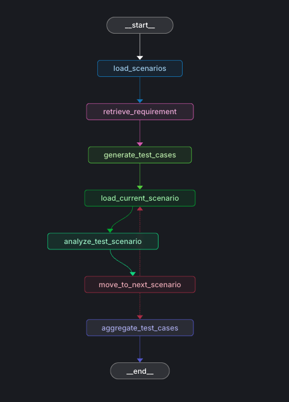

# Sentinel

## Installation

1. Install UV:

see documentation for your OS : https://docs.astral.sh/uv/getting-started/installation/#__tabbed_1_1

2. Install dependencies:

```bash
uv sync
```

## Create the Chroma vector database

```bash
make rag
```

## Langfuse

With docker compose see doc : https://langfuse.com/self-hosting/deployment/docker-compose

## Langchain studio

### Running the Server

Start the development server:

```bash
langgraph dev
```

This will start LangGraph Server.
You can click to the link "LangGraph Studio Web UI" in the console to go to webpage.

### Structure of the graph



## Example of .env

LANGSMITH_PROJECT=new-agent

GOOGLE_API_KEY=""
OPENROUTER_API_KEY=""

LANGFUSE_SECRET_KEY=""
LANGFUSE_PUBLIC_KEY=""
LANGFUSE_HOST=http://localhost:3000

